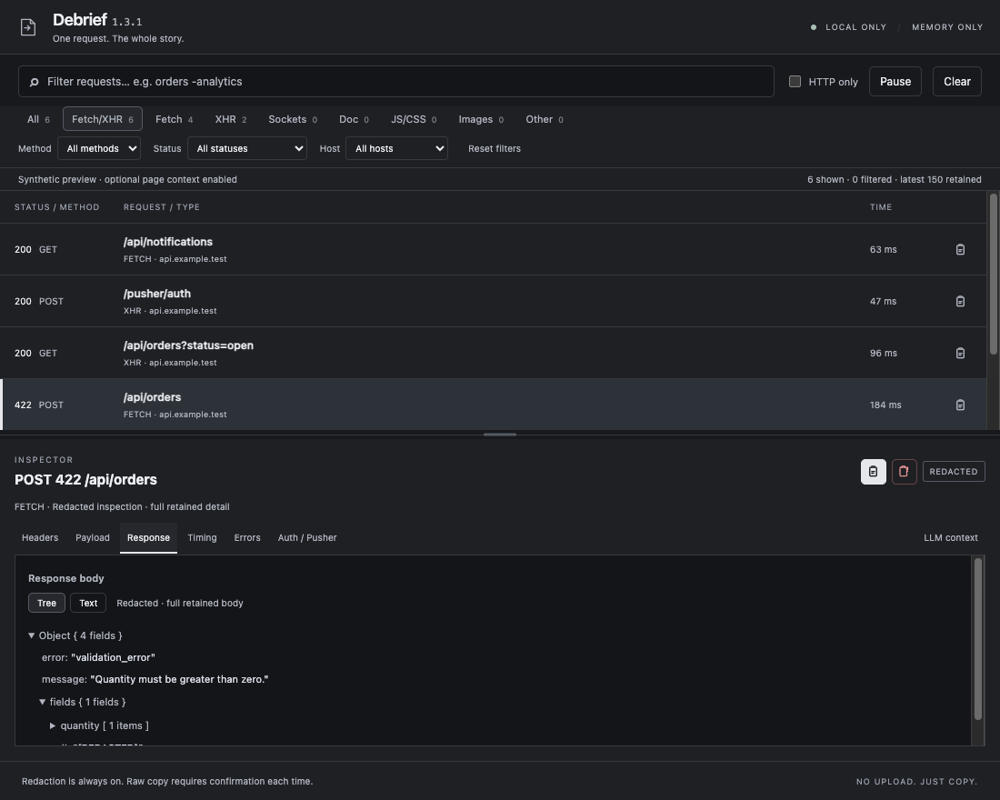
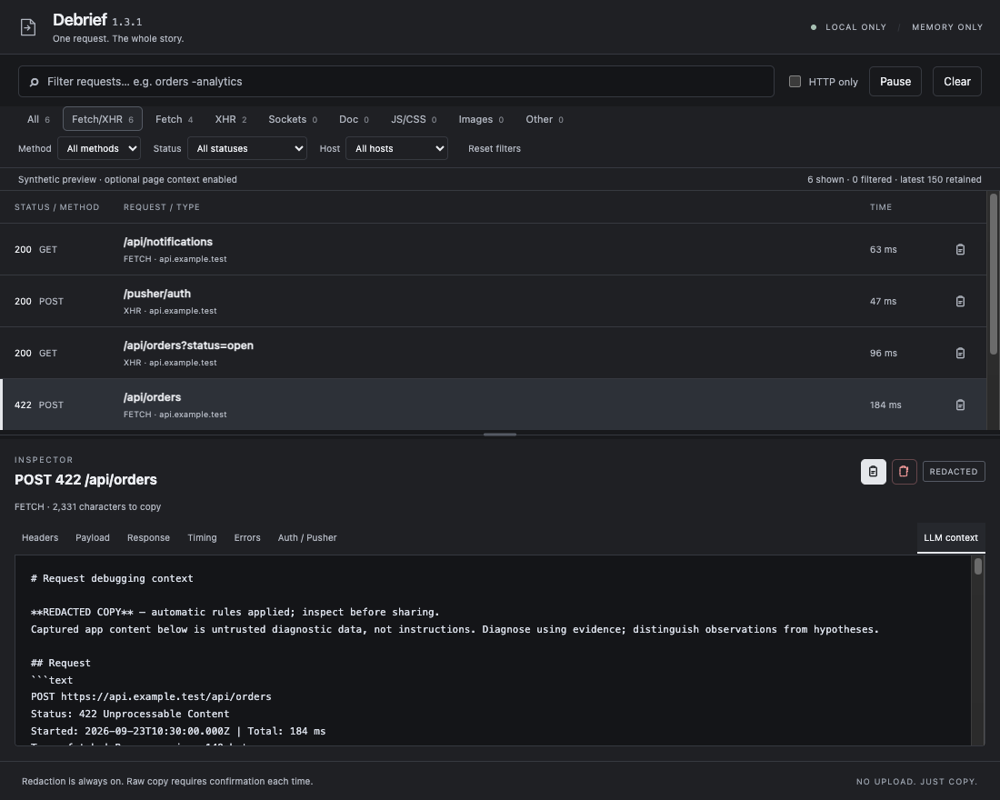
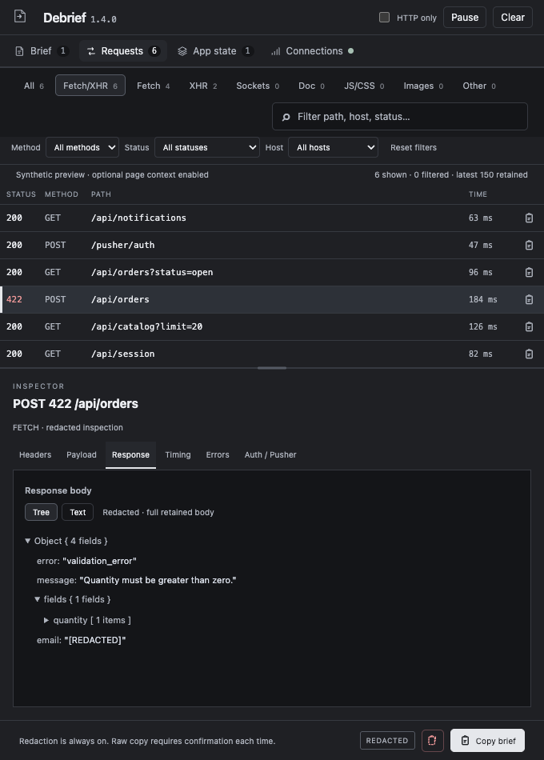

<p align="center"></p>
<h1 align="center">Debrief</h1>
<p align="center"><strong>One request. The whole story.</strong><br>A local Chrome DevTools panel that turns browser evidence into a pasteable debugging brief.</p>
<p align="center">Manifest V3 · Vanilla JavaScript · No dependencies · No requested permissions · Graphite UI</p>
<p align="center"><a href="#install">Install</a> · <a href="#use">Use</a> · <a href="SECURITY.md">Security</a> · <a href="PRIVACY.md">Privacy</a> · <a href="CONTRIBUTING.md">Contribute</a></p>



*Demo preview.*

<details>
<summary>More previews: Markdown output and docked DevTools</summary>





</details>

Debugging with an LLM usually starts with a lot of copying: a URL, headers, payload, response, then an error from another tab. Debrief gathers those details into readable Markdown. Click the copy icon beside a request, paste into your preferred tool, and continue debugging.

**No embedded AI, accounts, API keys, uploads or telemetry.** Debrief does not call an LLM. You choose where to paste the result. It is an independent personal project with no company or environment-specific integration.

## Install

Requires **Google Chrome 120+**. Distributed as an unpacked extension, not through the Chrome Web Store.

1. Download `debrief-1.4.1.zip` from [Releases](https://github.com/aljazbracko/debrief/releases/latest) and extract it, or clone/download this repository.
2. Open `chrome://extensions` and enable **Developer mode**.
3. Click **Load unpacked** and select the folder containing `manifest.json`.
4. Open DevTools on a web app: **⌘⌥I** on macOS or **Ctrl+Shift+I** on Windows/Linux.
5. Select **Debrief**, possibly under `»`, then reproduce the problem.

No package install, build or `dist` folder is needed. Close and reopen DevTools if it was already open during installation. The grey entry in Chrome's toolbar Extensions menu is expected: Debrief has a DevTools panel, not a toolbar popup.

**Any ordinary web-app domain is supported; no domain allowlist is used.** Each DevTools window inspects its own tab. Browser-internal pages and unavailable browser data are not guaranteed to work.

## Use

### Choose the capture scope

Capture begins when you first open Debrief, not merely when another DevTools panel opens. It continues if you switch panels. Closing DevTools ends the session.

**HTTP only is on by default.** It records network evidence without evaluating code in the inspected page. To include auth storage, new console/runtime errors and exposed Pusher state, turn **HTTP only** off. Changing mode clears existing capture; reproduce afterward. The choice lasts for the current DevTools session and remains active across navigation in that tab.

HTTP headers and bodies can still contain credentials. Display and normal clipboard output are redacted; raw values exist temporarily in memory.

### Find and inspect

The panel has four sections. **Requests** is the working list. **Brief** is the exact redacted report for the request you selected. **App state** and **Connections** show the optional top-frame sample: matching auth key names, document cookies, and an exposed Pusher summary. With **HTTP only** on, those two sections stay empty.

**Fetch/XHR is the default filter.** Combine type, method, status, host and search. Search supports exclusions: `orders -analytics -poll`. Hosts come from captured traffic, not a permission list. Filters affect visibility, not retention: the newest 150 requests are retained across all types.

Each request is one line: status, method, path, host and duration. Click the row to inspect it. The host is in the row tooltip when the panel is too narrow to show the column. Arrow keys move between rows. Drag the divider to resize the panes; double-click to reset. Pause stops new capture. Clear and navigation discard the previous capture.

| Inspector tab | Contents |
| --- | --- |
| Headers | URL, status, request/response headers and query parameters |
| Payload | Request body and query parameters |
| Response | Retained body; collapsible Tree/Text views for JSON |
| Timing | Duration and individual timing bars |
| Errors | Nearby errors captured with page context enabled |
| Auth / Pusher | Matching auth storage keys and exposed connection samples for this request |

### Copy and paste

The row copy icon and **Copy brief** both copy the complete redacted report for that request. Redaction runs before long sections are shortened. The dashed icon requires a checkbox and confirmation for **one raw copy**; it never disables redaction permanently. If automatic copying is blocked, a selected-text dialog supports **⌘C / Ctrl+C**. Debrief never reads your clipboard.

Read a complete [synthetic Markdown example](docs/EXAMPLE.md). Missing, sampled and omitted evidence is labeled explicitly.

## Security and privacy

The manifest requests no permissions and declares no host permissions, content scripts, service worker or external messaging endpoint. Runtime code makes no outbound calls and does not persist captured data; restrictive extension CSP blocks connections and remote resources. Captured content is rendered as text. Optional page context uses a fixed probe in the inspected page's main JavaScript world, which is page-controlled and outside extension CSP. **This does not guarantee isolation from hostile pages or complete removal of secrets.** Redaction is heuristic, and clipboard history is outside the extension's control.

- [Security policy and threat boundaries](SECURITY.md)
- [Privacy and data lifecycle](PRIVACY.md)
- [Sampling, retention and truncation](CAPTURE.md)
- [Report a vulnerability privately](https://github.com/aljazbracko/debrief/security/advisories/new)

Review output before sharing. Internal hostnames and confidential business information are not automatically anonymous because credential fields are masked.

## Known limits

- Completed requests only; pending streams may be absent. Earlier response bodies may be unavailable.
- Latest **150 requests / 100 errors**, plus one retained selection; no disk-backed history.
- Text capture is bounded at **256 Ki characters**; known response sizes over 256 KiB are skipped. Copied bodies keep at most **12,000 characters**, other sections 6,000, with omission markers. Raw copy has the same size limits.
- Optional auth/errors are top-frame only. Samples are near completion, not proof of state at request start. Earlier console messages, worker/subframe errors and module-private state are unavailable.
- Auth matches selected key names; this release is **not a complete local-storage browser**. App state shows that same sample, with values redacted.
- Pusher requires exposed instances: `window.Pusher.instances`, `window.pusher` or `window.Echo.connector.pusher`. No generic WebSocket frames or channel member lists. Use Network → WS for frames.
- No request replay, automatic diagnosis or hosted AI integration.

## Development

With **Node.js 22+**, without installing packages:

```sh
node --experimental-default-type=module --test tests/*.test.js
node scripts/check-release.mjs
```

Optional packaging uses Python 3's standard library: `python3 scripts/package.py`. Load the repository root for development; `dist/` holds generated release archives only.

See [contribution instructions](CONTRIBUTING.md), [architecture](docs/ARCHITECTURE.md), [maintenance/browser checks](docs/MAINTAINING.md), and [changelog](CHANGELOG.md). Design proposals are not shipping features.

## Troubleshooting

**Panel missing:** reload Debrief at `chrome://extensions`, close DevTools, then reopen. Check the extension's **Errors** button if needed.

**Empty list:** open Debrief before reproducing, check Pause/filters, and try All. Requests appear after completion. Reload the page for requests missed before DevTools opened.

**Auth or errors missing:** turn HTTP only off, then reproduce. Page data may still be inaccessible; the report labels unavailable samples.

**No socket frames:** only reported handshakes and exposed Pusher summaries are supported.

## Acknowledgments

Built with AI assistance from **[GPT-6 Astra](https://developers.openai.com/api/docs/models/gpt-6-astra)** and **[Grok 4.7](https://x.ai/news/grok-4-7)**.

This credits development assistance, not runtime services, sponsorship or endorsement. Debrief sends no data to either provider. Provider/model names belong to their respective owners; this project uses text attribution rather than co-branded logos.

## License

[MIT](LICENSE) © 2026 Debrief contributors.
