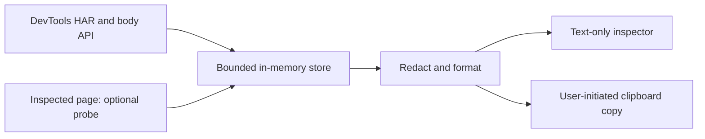

# Architecture

Runtime modules are plain ES modules loaded from the extension package. There is no background service worker, build tool, dependency installer or network client.

| File | Responsibility |
| --- | --- |
| `manifest.json` | MV3, zero permissions, restrictive extension CSP |
| `devtools.js` | Panel registration; lazy start on first panel selection |
| `store.js` | HAR bootstrap, request retention, sampling, mode and lifecycle |
| `probe.js` | All optional main-world code: auth reads, error hook, exposed Pusher |
| `redact.js` | Shared masking policy, nested values and known-secret echoes |
| `format.js` | Inspection/report sections, fences, limits and omissions |
| `filters.js` | Type classification, safe labels and filtering |
| `inspector.js` | Text tables, bounded JSON trees and timing bars |
| `panel.js` | Section navigation, selection, rendering, mode toggle and per-copy raw confirmation |

## Boundaries

Page context is enabled by default when Debrief is first selected. Starting in HTTP-only mode avoids the page probe entirely; switching into it detaches an existing probe and stops further sampling. Page-context mode samples every second and temporarily wraps `console.error`, forwarding the existing behavior. It is not isolated from page-modified JavaScript. Probe output is data, never a new code expression. Generation checks discard callbacks from old captures; a separate probe epoch rejects late samples after a mode change or pause.

Raw values must remain available in memory for the explicit raw-copy path. Normal display and copying share redaction; output truncation happens afterward. Filters do not reduce capture, and the selected request can outlive the rolling buffer until Clear/navigation/mode change.

`scripts/` and `docs/` are development resources. They are not loaded by the extension and are excluded from the runtime portion of a release package. See [SECURITY.md](../SECURITY.md) for the complete trust boundary.
